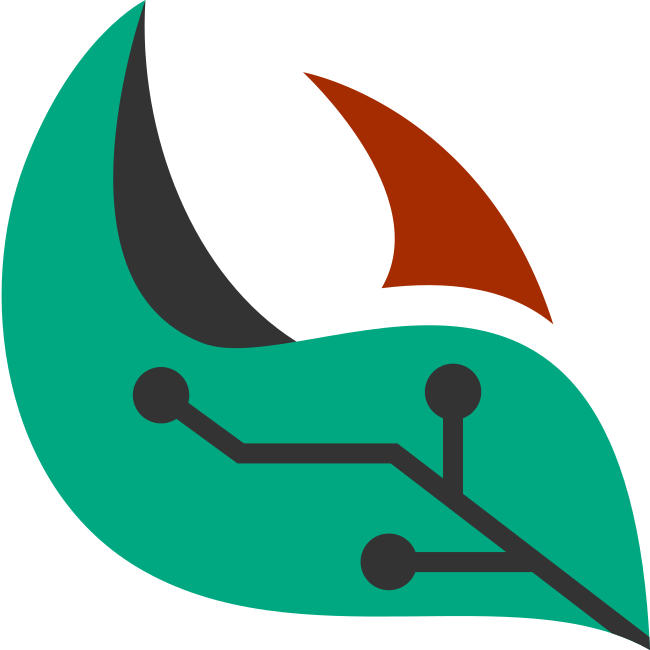

# Leaf


Leaf is a Rust-oriented framework for dynamic analysis built around MIR instrumentation. It wraps the Rust compiler through `leafc`, instruments a program at compile time, and routes runtime events to pluggable backends for tracing, symbolic execution, and related analyses.

## Project layout

- `compiler/`: the `leafc` driver and instrumentation pipeline
- `runtime/lib`: the shared abstraction library for implementing runtime backends
- `runtime/backends/`: concrete backend implementations
- `common/`: shared facilities and definitions used across the project

## Requirements

- Rustup and cargo to install nightly toolchains, `rustc` libraries and building the project.
- Python for helper scripts (e.g., toolchain builder) in the repository

## Quick start
1. Clone the repository and build the compiler:
   ```console
   $ git clone https://github.com/sfu-rsl/leaf.git
   $ cd leaf
   $ cargo install --path ./compiler
   ```

1. Build a runtime backend, for example the control-flow tracer:
   ```console
   $ cargo build -p runtime_cf_tracer
   ```

1. Make the shared library discoverable to the generated program:
   ```console
   $ mkdir -p target/debug/runtime_cf_tracer
   $ ln -sf target/debug/runtime_cf_tracer.so target/debug/runtime_cf_tracer/libleafrt.so
   $ export LD_LIBRARY_PATH="$PWD/target/debug/runtime_cf_tracer:$LD_LIBRARY_PATH"
   ```

1. Compile a sample program with `leafc`:
   ```console
   $ leafc samples/hello_world.rs
   ```

1. Run the instrumented binary with logging enabled:
   ```console
   $ export LEAF_LOG="info"
   $ ./hello_world
   ```

The generated program will emit runtime events through the active backend, which can be inspected through the logging output or any backend-specific artifacts.

## Documentation

Further information, tutorials, and technical details are collected in Leaf Book @
[sfu-rsl.github.io/leaf](https://sfu-rsl.github.io/leaf) (WIP).

## Publications
- Leaf: An Instrumentation-based Dynamic Analysis Framework for Rust: [arXiv](https://arxiv.org/abs/2607.15025)

## License

Leaf is licensed under the MIT or Apache-2.0 licenses.

- Apache License, Version 2.0: [LICENSE-APACHE](LICENSE-APACHE)
- MIT License: [LICENSE-MIT](LICENSE-MIT)

